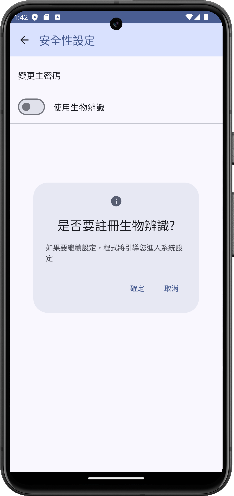

[中文版](README.md)

[English Version](README_en.md)

# Vault Guard - 您的密碼管理器

**Vault Guard** 為免費且開放原始碼的`Android`應用程式，提供使用者密碼管理的功能。

## 簡介

本專案為`Android`應用程式，程式提供使用者產生、儲存、搜尋、備份密碼的功能，同時也提供產生TOTP驗證碼的功能，使用者可以將其作為密碼器使用，或是單純用於兩步驟驗證的驗證器(例如: Google Authenticator、Microsoft Authenticator、Authy)使用。

我們重視使用者的資料安全及隱私，所有資料皆加密儲存於使用者的手機，為了避免意外發生，程式也提供備份功能，不過匯出的檔案不會經過加密，需妥善保存，建議將檔案「離線保存」並多備份，例如: 乾淨的隨身碟、手機內的安全資料夾。

⚠️ 請注意，由於資料儲存於使用者的手機，請使用者務必牢記主密碼，忘記主密碼將導致無法存取密碼庫，需將程式資料刪除或解除安裝後重新安裝，這將導致過去儲存的密碼被刪除，如果擔心忘記主密碼，可使用`匯出密碼庫`的功能，這樣可透過`匯入密碼庫`的功能還原過去儲存的密碼。

## 下載

請從 [Google Play](https://play.google.com/store/apps/details?id=com.keke125.vaultguard) 下載程式，或是您也可以從 [Release](https://github.com/keke125/VaultGuard/releases) 找到檔名為`VaultGuard-1.x.x-android`的`APK`檔並安裝，我們建議您安裝最新版本。 

## 技術

### 程式語言、專案管理、資料庫
  

### 版本控制

### 支援的作業系統

## 授權條款

## 官方網站
https://vaultguard.keke125.com/

## Q & A

- 忘記主密碼怎麼辦?  
由於加密金鑰及資料皆儲存於您的手機，我們無法幫您重設主密碼，您需將程式資料刪除或解除安裝後重新安裝，但這將導致過去儲存的密碼被刪除，如果您擔心忘記主密碼，您可定期使用`匯出密碼庫`的功能來備份密碼庫，這樣可透過`匯入密碼庫`的功能來還原之前儲存的密碼。

- 什麼是TOTP驗證碼?  
TOTP（Time-Based One-Time Password）驗證碼是一種基於時間的一次性驗證碼，用於雙因素驗證（2FA）或多因素驗證（MFA）系統，它會根據當前時間產生一個短暫有效的驗證碼，通常是6位或8位數字，並每隔30秒或60秒自動更新，因為有效期較短，相比密碼來說被盜用的損失也較小，因為實作成本較低，常作為一種雙重驗證的方式。

## 程式截圖

<figure><figcaption>
新增密碼
</figcaption></figure>

<figure><figcaption>
編輯密碼
</figcaption></figure>

<figure><figcaption>
檢視密碼
</figcaption></figure>

<figure><figcaption>
搜尋密碼
</figcaption></figure>

<figure><figcaption>
檢視資料夾內的密碼
</figcaption></figure>

<figure><figcaption>
編輯及刪除資料夾
</figcaption></figure>

<figure><figcaption>
密碼產生器
</figcaption></figure>

<figure><figcaption>
匯入密碼
</figcaption></figure>

<figure><figcaption>
匯出密碼
</figcaption></figure>

<figure><figcaption>
如裝置未設定生物辨識，將引導使用者註冊生物辨識
</figcaption></figure>

<figure><figcaption>
使用生物辨識解鎖密碼庫
</figcaption></figure>

<figure><figcaption>
可新增圖塊，以便快速開啟密碼庫
</figcaption></figure>

<figure><figcaption>
掃描QR Code，以便取得TOTP驗證碼
</figcaption></figure>

## 主要特色
- 資料安全: 您的資料將加密並只會儲存於您的手機，他人（包含開發者）皆無法透過網路存取您的密碼庫，請放心使用。

- 隱私: 我們不會收集關於您的任何資訊，程式並沒有存取網路的權限，另外，只有在您需要使用特定功能時，我們才會跟您索取相關權限，例如生物辨識解鎖密碼庫需要生物辨識權限、掃瞄QR Code(TOTP驗證碼)需要相機權限。

- 備份及還原（匯出及匯入密碼庫）: 當您想要更換手機或是定期備份時，可使用「匯出密碼庫」功能，之後，您可使用「匯入密碼庫」功能將匯出的檔案重新匯入到您的新手機，由於密碼匯出後並不會經過加密，請您妥善保管匯出的檔案。

- 從Google密碼管理器匯入密碼: 程式支援從Google密碼管理器匯入的功能，您可先於Google密碼管理器匯出密碼，並將密碼匯入到我們的程式。

- 開源: 程式以MIT授權條款開放原始碼，您可以於 https://github.com/keke125/VaultGuard 查看完整的程式碼。

- 免費: 使用程式並不需要任何費用，我們也不會加入廣告。

- 鎖定密碼庫: 為了您的安全，程式將在您登入後超過1小時，自動鎖定密碼庫，請輸入主密碼解鎖，您也可啟用生物辨識功能來解鎖。

- 多因子（兩步驟）驗證: 您可將TOTP驗證碼存入密碼庫，幫助您進行多因子（兩步驟）驗證。

- 相容性: 我們支援Android 7.0及以上的版本。

- 資料夾: 您可將密碼放入不同的資料夾管理，您也可在資料夾內新增、檢視、更新、刪除及搜尋密碼，也可將資料夾及底下的密碼一起刪除。

- 快速設定: 您可在系統選單頁面中新增圖塊(tile)，即可快速開啟程式。

- 支援語言: 程式支援繁體中文及英文。

感謝您使用我們的程式!

## 程式碼行數

