[中文版](README.md)

[English Version](README_en.md)

# Vault Guard - Your Password Manager

**Vault Guard** is a free and open-source Android application that provides users with password management features.

## Introduction

This project is an Android application that provides users with functions to generate, save, search, and back up passwords. It also offers a feature to generate TOTP (Time-Based One-Time Password) codes, allowing users to use the app either as a password manager or solely as an authenticator (e.g., Google Authenticator, Microsoft Authenticator, Authy) for two-step verification.

We value the security and privacy of user data; therefore, all data is encrypted and stored on the user's device. To prevent data loss due to unexpected incidents, the app also provides a backup function. However, please note that the exported files are not encrypted, so they must be stored securely. We recommend "offline storage" and multiple backups, such as on a clean USB drive or a secure folder within the device.

⚠️ Please note that since data is stored on the user's device, it is crucial for users to remember their main password. Forgetting the main password will result in the inability to access the vault, requiring users to delete the app data or uninstall and reinstall the app, which will cause all previously saved passwords to be deleted. If you are worried about forgetting your main password, you can use the `Export Vault` feature, which allows you to restore previously saved passwords through the `Import Vault` feature.

## Download
Please download the app from [Google Play](https://play.google.com/store/apps/details?id=com.keke125.vaultguard) . Alternatively, you can find the `APK` file named `VaultGuard-1.x.x-android` in the [Release](https://github.com/keke125/VaultGuard/releases) and install it. We recommend installing the latest version.

## Technology

### Programming Language, Project Management, Database
  

### Version Control

### Supported Operating System

## License

## Official Website
https://vaultguard.keke125.com/

## Q & A

- What to do if you forget your main password?  
  Since the encryption key and data are stored on your device, we cannot help you reset your main password. You will need to delete the app data or uninstall and reinstall the app, but this will result in the deletion of all previously saved passwords. If you are worried about forgetting your main password, you can regularly use the `Export Vault` feature to back up your vault. This way, you can restore your previously saved passwords using the `Import Vault` feature.

- What is a TOTP Verification Code?  
A TOTP (Time-Based One-Time Password) verification code is a time-based, one-time password used in two-factor authentication (2FA) or multi-factor authentication (MFA) systems. It generates a short-lived code based on the current time, typically a 6-digit or 8-digit number, which automatically updates every 30 or 60 seconds. Due to its short validity period, the potential damage from theft is much smaller compared to traditional passwords. Because it is relatively low-cost to implement, it is commonly used as a method of two-factor authentication.

## App Screenshots

<figure>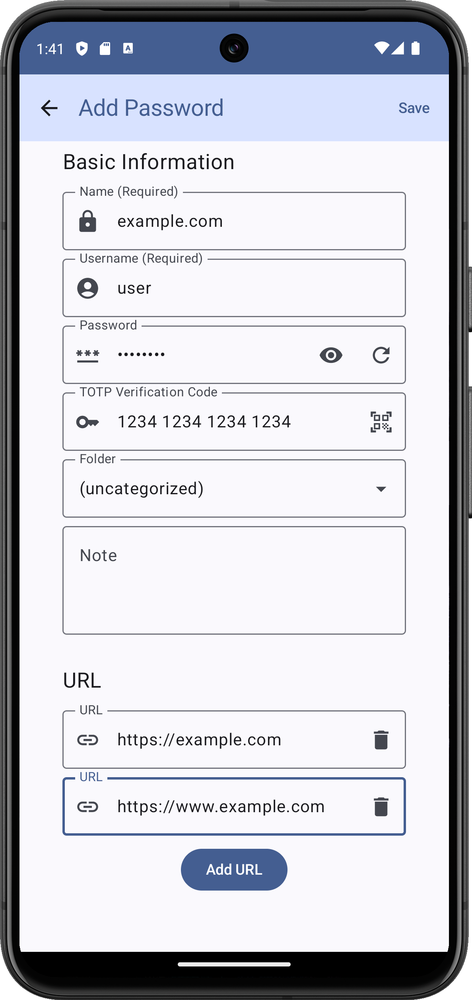<figcaption>
Add Password
</figcaption></figure>

<figure>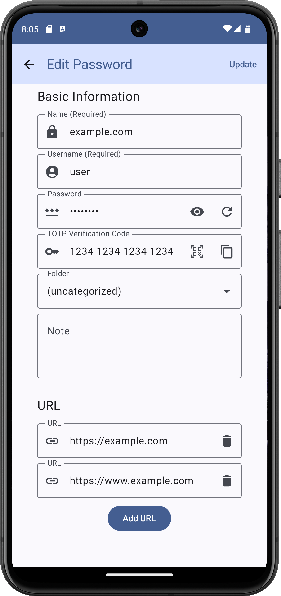<figcaption>
Edit Password
</figcaption></figure>

<figure>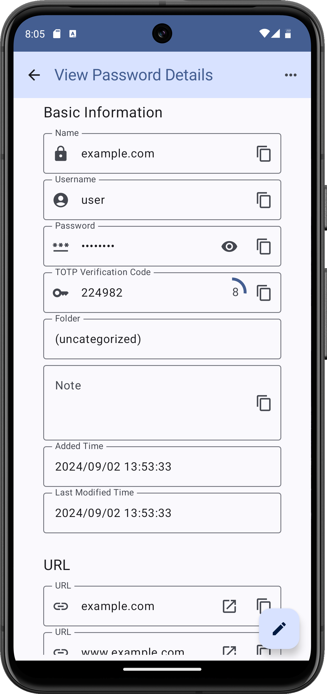<figcaption>
View Password Details
</figcaption></figure>

<figure>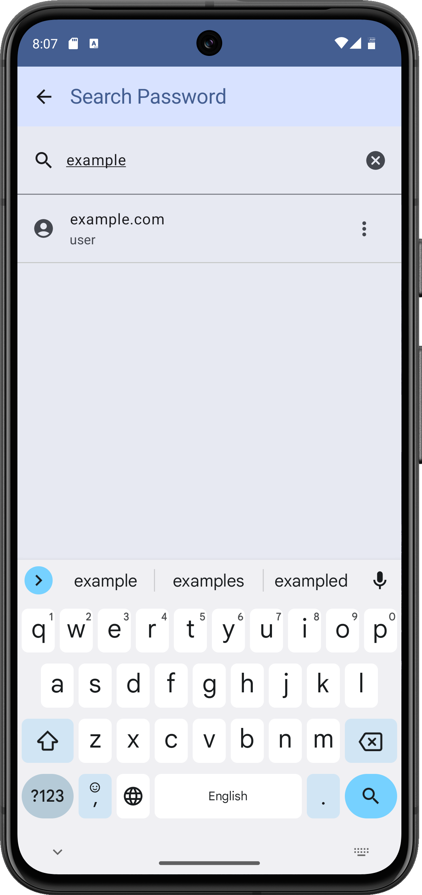<figcaption>
Search Password
</figcaption></figure>

<figure>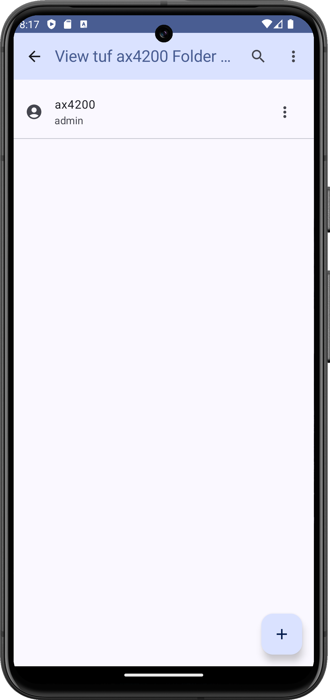<figcaption>
View Passwords in the Folder
</figcaption></figure>

<figure>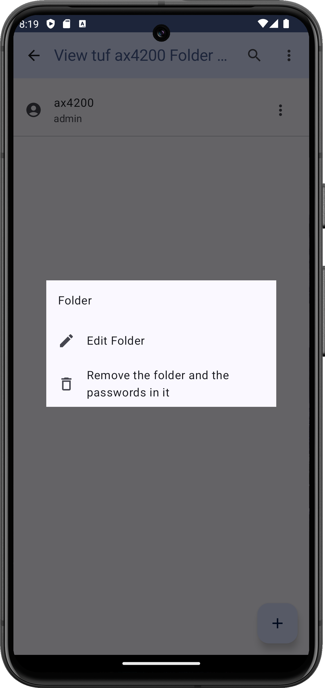<figcaption>
Edit and Remove Folder
</figcaption></figure>

<figure>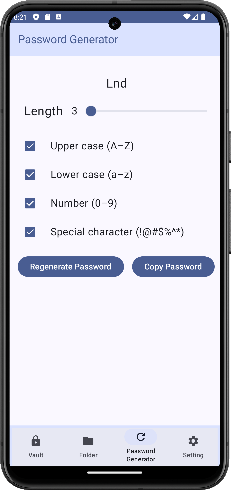<figcaption>
Password Generator
</figcaption></figure>

<figure>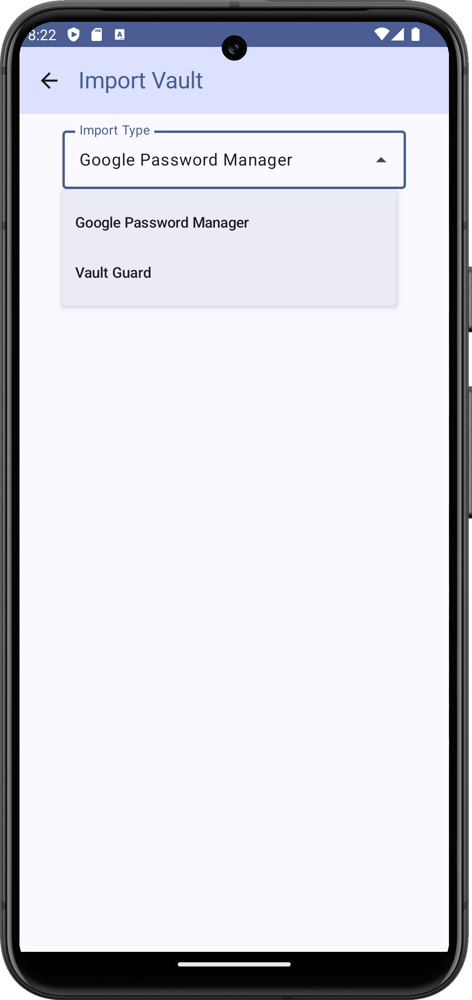<figcaption>
Import Vault
</figcaption></figure>

<figure>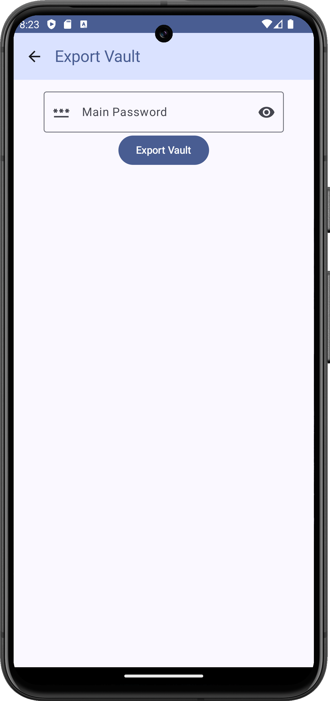<figcaption>
Export Vault
</figcaption></figure>

<figure>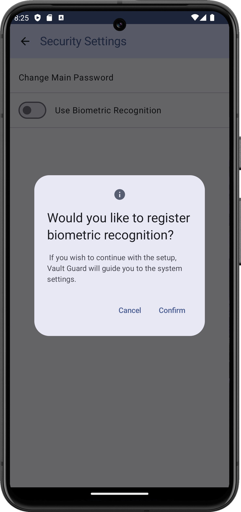<figcaption>
If the device does not have biometric authentication set up, the user will be prompted to register for biometric authentication.
</figcaption></figure>

<figure>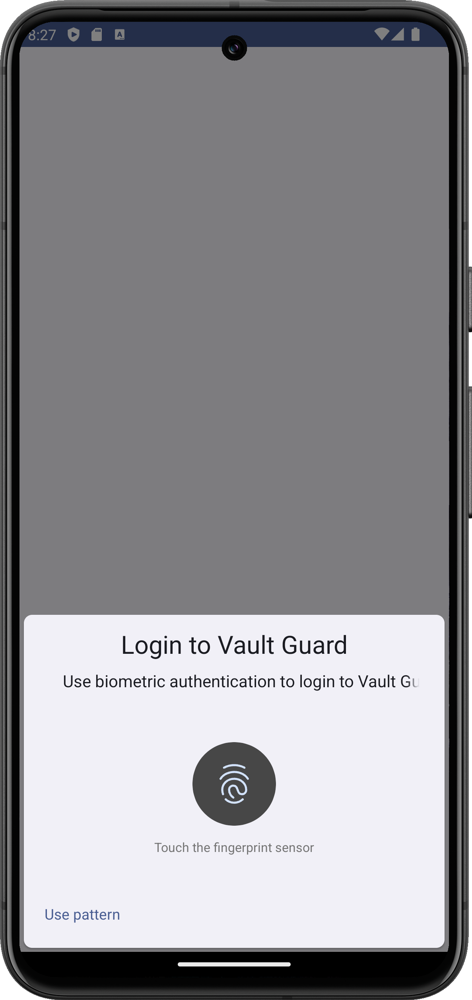<figcaption>
Unlock the Vault Using Biometric Authentication.
</figcaption></figure>

<figure>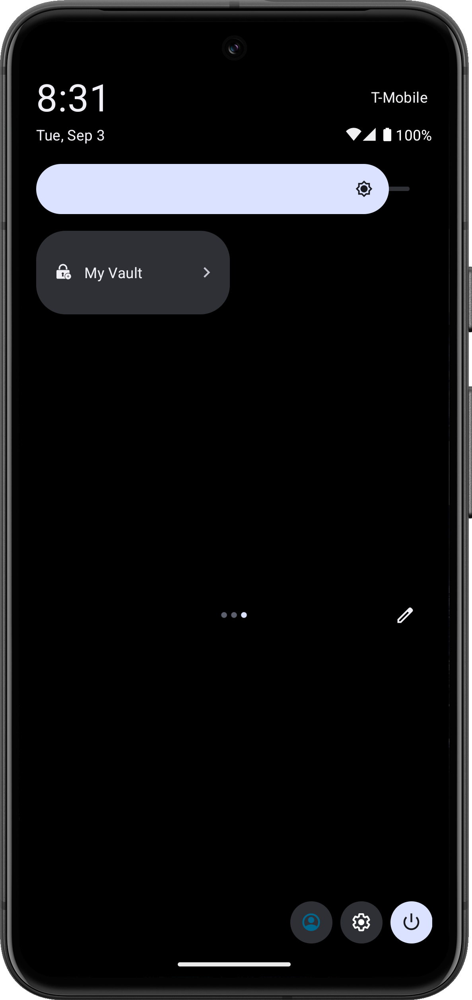<figcaption>
You can add a tile for quick access to the vault.
</figcaption></figure>

<figure>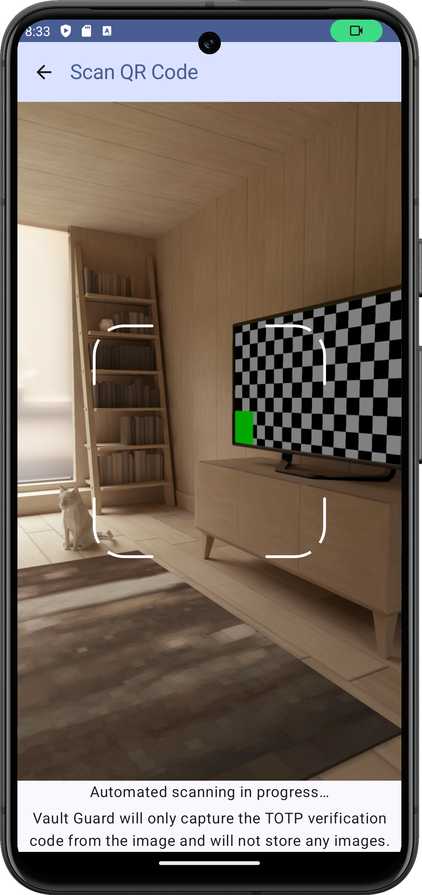<figcaption>
Scan a QR code to obtain a TOTP verification code.
</figcaption></figure>

## Feature
- Data Security: Your data will be encrypted and stored only on your device; others (including the developers) will not be able to access your vault via the internet. Please use it with confidence.

- Privacy: We do not collect any information about you. The app does not have network access permissions. Additionally, we only request permissions when you need to use specific features, such as biometric authentication for unlocking the vault or camera access for scanning QR codes (TOTP codes).

- Backup and Restore (Export and Import Vault): When you want to switch phones or back up regularly, you can use the "Export Vault" feature. Later, you can use the "Import Vault" feature to import the exported file to your new device. Since the exported file is not encrypted, please handle it with care.

- Import Passwords from Google Password Manager: The app supports importing passwords from Google Password Manager. You can first export your passwords from Google Password Manager and then import them into our app.

- Open Source: The app is open source under the MIT License. You can view the full source code at https://github.com/keke125/VaultGuard.

- Free: Using the app is free of charge, and we do not include ads.

- Locking the Vault: For your safety, the app will automatically lock the vault after you log in for more than 1 hour. Please enter your main password to unlock it. You can also enable biometric authentication to unlock it.

- Multi-Factor (Two-Step) Authentication: You can store TOTP verification codes in the vault to assist with multi-factor (two-step) authentication.

- Compatibility: We support Android 7.0 and above.

- Folders: You can manage passwords in different folders. You can also add, view, update, delete, and search for passwords within folders, as well as delete folders and their contained passwords.

- Quick Setup: You can add a tile in the system menu page to quickly open the app.

- Supported Languages: The app supports Traditional Chinese and English.

Thank you for using our app!

## CLOC (Count Lines of Code)

